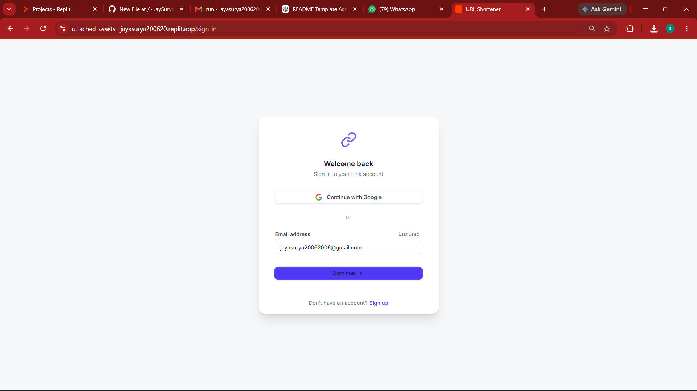
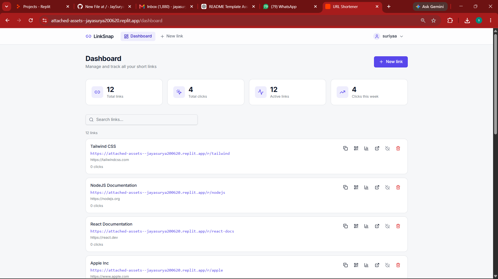
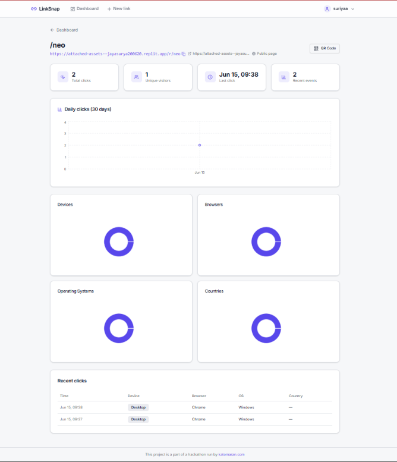
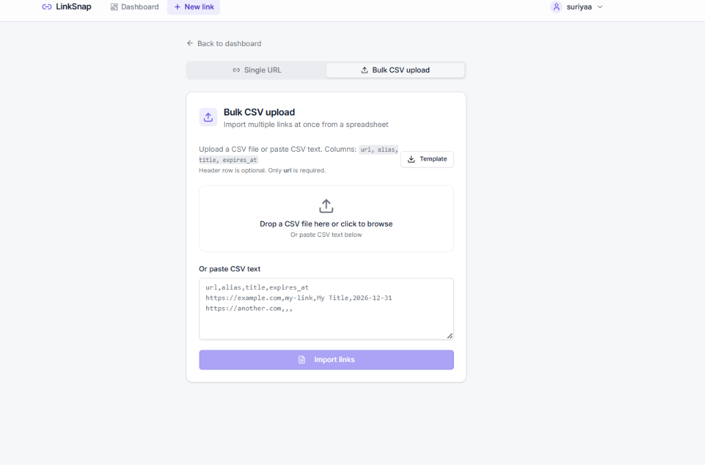

# 🔗 URL Shortener with Analytics

A modern full-stack URL Shortener application that allows authenticated users to create, manage, and analyze shortened URLs through an interactive dashboard.

---

## 📌 Overview

This application enables users to shorten long URLs into compact shareable links while tracking analytics such as click count, visit history, and last visited timestamps.

The project demonstrates full-stack engineering concepts including authentication, database design, REST APIs, analytics tracking, and responsive UI development.

---

## ✨ Features

### 🔐 Authentication

* User Registration
* User Login
* JWT Authentication
* Protected Routes
* User-specific URL Management

### 🔗 URL Shortening

* Create short URLs from long URLs
* Unique short code generation
* URL validation before creation
* Redirect short URLs to original URLs
* Copy short URL with one click

### 📊 Dashboard

* View all shortened URLs
* Original URL display
* Short URL display
* Created Date
* Click Count
* Delete URLs

### 📈 Analytics

* Total Click Count
* Last Visited Timestamp
* Recent Visit History
* URL Performance Tracking

### 📂 Bulk CSV Upload

* Upload multiple URLs at once
* CSV validation
* Batch URL shortening

### 🎨 User Experience

* Responsive Design
* Loading States
* Success & Error Notifications
* Form Validation
* Modern UI

---

## 🛠 Tech Stack

### Frontend

* React
* TypeScript
* Vite
* Tailwind CSS

### Backend

* Node.js
* Express.js

### Database

* PostgreSQL

### Authentication

* JWT
* Password Hashing

### Validation

* Zod

### Package Manager

* PNPM

---

## 📁 Project Structure

```text
URL-Shortener/
│
├── artifacts/
│   │
│   ├── url-shortener/
│   │   ├── src/
│   │   ├── public/
│   │   ├── components/
│   │   ├── pages/
│   │   └── package.json
│   │
│   ├── api-server/
│   │   ├── src/
│   │   ├── routes/
│   │   ├── controllers/
│   │   ├── middleware/
│   │   └── package.json
│   │
│   └── mockup-sandbox/
│
├── lib/
│   ├── api-client-react/
│   ├── api-spec/
│   ├── api-zod/
│   └── db/
│
├── scripts/
├── package.json
├── pnpm-workspace.yaml
└── README.md
```

---

## 🏗 System Architecture

```text
React Frontend
       │
       ▼
 REST API Server
       │
       ▼
 PostgreSQL Database
       │
       ▼
 Analytics Tracking
```

---

## ⚙ Installation

### Clone Repository

```bash
git clone https://github.com/YOUR_USERNAME/YOUR_REPOSITORY.git

cd YOUR_REPOSITORY
```

### Install Dependencies

```bash
pnpm install
```

### Configure Environment Variables

Create a `.env` file:

```env
PORT=5000
DATABASE_URL=your_database_url
JWT_SECRET=your_secret_key
BASE_URL=http://localhost:5000
```

### Start Backend

```bash
cd artifacts/api-server

pnpm dev
```

### Start Frontend

```bash
cd artifacts/url-shortener

pnpm dev
```

### Open Application

```text
Frontend: http://localhost:3000

Backend: http://localhost:5000
```

---

## 📡 API Endpoints

### Authentication

| Method | Endpoint           | Description   |
| ------ | ------------------ | ------------- |
| POST   | /api/auth/register | Register User |
| POST   | /api/auth/login    | Login User    |

### URL Management

| Method | Endpoint         | Description      |
| ------ | ---------------- | ---------------- |
| POST   | /api/url/shorten | Create Short URL |
| GET    | /api/url/all     | Get User URLs    |
| DELETE | /api/url/:id     | Delete URL       |

### Analytics

| Method | Endpoint                  | Description    |
| ------ | ------------------------- | -------------- |
| GET    | /api/analytics/:shortCode | View Analytics |

---

## 🗄 Database Design

### Users

```json
{
  "id": "uuid",
  "name": "John Doe",
  "email": "john@example.com",
  "password": "hashed_password"
}
```

### URLs

```json
{
  "id": "uuid",
  "originalUrl": "https://example.com",
  "shortCode": "abc123",
  "createdAt": "timestamp",
  "userId": "uuid",
  "clickCount": 25
}
```

### Analytics

```json
{
  "id": "uuid",
  "urlId": "uuid",
  "visitedAt": "timestamp"
}
```

---

## 📋 Assumptions Made

1. Each short code is unique.
2. Analytics are stored in the database.
3. Users can only manage their own URLs.
4. Invalid URLs are rejected.
5. Authentication is required for URL management.
6. Every redirect increments click analytics.

---

## 🤖 AI Planning Document

### Planning Process

1. Requirement Analysis
2. Database Schema Design
3. REST API Design
4. Authentication Implementation
5. URL Shortening Logic
6. Analytics Tracking
7. Dashboard Development
8. Bulk CSV Upload Feature
9. Testing & Deployment

### AI Usage

AI tools were used for:

* Application planning
* UI generation
* API design
* Database modeling
* Code debugging
* Documentation generation

---
## Screenshots

### Opening Page


### Login Page


### Authentication Page


### Dashboard


### Analytics


### Bulk CSV Upload

## 🎥 Demo Video

Add your Loom or YouTube video link here.

VIDEO:
https://youtu.be/sxVFqxplYn8

---

## 📊 Sample Output

### URL Record

```json
{
  "originalUrl": "https://google.com",
  "shortCode": "g8k2xY",
  "clickCount": 12
}
```

### Analytics Record

```json
{
  "urlId": "123",
  "visitedAt": "2026-06-15T10:30:00Z"
}
```

---

## 🚀 Future Enhancements

* Custom Alias Support
* QR Code Generation
* URL Expiry
* Device Analytics
* Browser Analytics
* Geolocation Tracking
* Daily Click Charts
* Public Statistics Page
* Bulk Import Improvements

---

## 👨‍💻 Author

Jay Suryaa R

---

## License

This project is licensed under the MIT License.

---

### This project is a part of a hackathon run by https://katomaran.com
